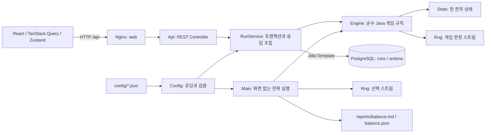
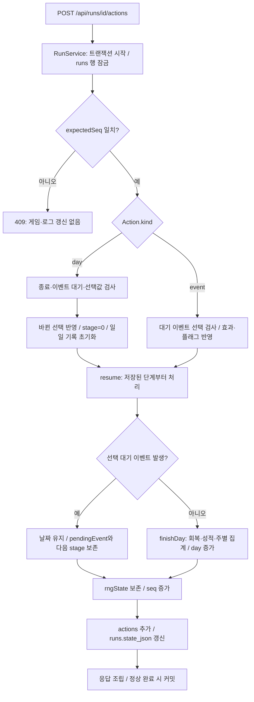

# 고교 축구선수 육성 프로토타입 구현 문서

이 문서는 현재 저장소의 코드, JSON 설정, 테스트 소스와 저장된 리포트를 분석한 결과다. 새 기능이나 수정안을 구현하지 않았다. 파일 경로는 저장소 루트를 기준으로 표기하며, 링크는 이 문서가 있는 `docs/`를 기준으로 연결한다.

검증을 구분해 읽어야 한다. **구현 확인**은 현재 소스와 설정에서 확인한 사실, **기존 검증 결과**는 리포트·테스트 산출물의 기록, **코드에서 도출**은 실행 흐름에서 계산한 결과다. 이번 문서 작업에서는 테스트와 밸런스 시뮬레이터를 다시 실행하지 않았다. 로컬 서비스의 HTML과 상태 확인 API만 읽기 전용으로 조회했다.

## 1. 프로젝트 개요

목적은 고1 축구부원의 하루 일과와 경기 판정을 1년 동안 진행하며 성장 수치와 밸런스를 관찰하는 것이다.

| 항목 | 현재 구현 |
| --- | --- |
| 범위 | 고1 48주, 공격수·파워형 하나, 주말리그 14경기, 32개교 춘계배, 이벤트 30편 |
| 백엔드 | Java 21, Spring Boot 3.3.4, PostgreSQL 16, Spring JDBC |
| 프론트엔드 | TypeScript 5.6.3, React 18.3.1, Vite 5.4.10, Zustand 5.0.1, TanStack Query 5.59.16 |
| 브라우저 검증 | Playwright; lockfile에 설치 버전 1.56.1 기록 |
| 실행 | Docker Compose; 프론트엔드 프로덕션 파일은 Nginx가 제공 |
| 웹 주소 | 기본 `http://localhost:5187`; `WEB_PORT`로 변경 가능 |
| 구현 상태 | 일과·경기·대회·이벤트·저장·재현·시즌 요약·대량 시뮬레이터 구현. 12월 보충수업 적용일은 미확정 |
| 기존 검증 결과 | Java 28개, 브라우저 2개 통과 기록; 동일 시드 두 시즌과 3,000시즌 집계 기록 |

현재 코드에는 로그인·계정·과금·장비·회차 메타·전체 사용자 순위표·2~3학년·다른 포지션/유형·스카우트·엔딩 분기·게임 엔진·Redis가 없다. 화면의 리그 순위표는 한 판 안의 학교 순위이며, 외부 사용자 순위표가 아니다. 배포 설정은 로컬 Compose 실행을 위한 것이다.

문서 작성 시 `http://localhost:5187/`에서 제목이 **첫 시즌 · 고교 축구선수 육성**인 HTML을 확인했고, `http://localhost:5187/api/health`에서 `{"status":"ok"}`를 확인했다. 이는 조회 당시 응답 확인이며 이후 가동 상태를 보장하는 기록은 아니다.

근거: [README.md](../README.md), [pom.xml](../pom.xml), [frontend/package.json](../frontend/package.json), [frontend/package-lock.json](../frontend/package-lock.json), [compose.yaml](../compose.yaml), [reports/validation.md](../reports/validation.md).

## 2. 전체 아키텍처

도메인은 Spring에 의존하지 않는다. 다만 `domain` 모듈 전체가 외부 라이브러리와 I/O까지 없는 구조는 아니다. `Config`는 Jackson을 사용해 파일·JSON을 읽고 설정을 직렬화한다. 규칙 계산은 `Engine`, 난수 생성은 `Rng`, 상태 표현은 `State`가 맡는다.



| 책임 | 실제 위치와 동작 |
| --- | --- |
| 프론트엔드 | `frontend/src/main.tsx`: 요청을 보내고 서버 결과를 표시. 승패·성장·부상·이벤트 판정을 계산하지 않음 |
| API | `server/src/main/java/game/server/Api.java`: HTTP 경로, 입력 record, 일부 예외의 상태 코드 매핑 |
| 애플리케이션 | `server/src/main/java/game/server/RunService.java`: 판 생성·조회·진행·재현, DB 잠금, 로그 추가, 스냅샷 갱신, 표시용 값 조립 |
| 도메인 | `domain/src/main/java/game/domain/Engine.java`: 캘린더, 일과, 훈련, 경기, 순위, 이벤트를 하나의 상태 머신에서 계산 |
| 설정 로딩 | `domain/src/main/java/game/domain/Config.java`: 9개 게임 설정 JSON을 묶어서 읽음. 전략 JSON은 시뮬레이터가 별도로 읽음 |
| 영속성 | `RunService`의 SQL 및 `server/src/main/resources/schema.sql`: 별도 Repository 클래스, ORM entity, JPA 계층 없음 |
| 시뮬레이터 | `simulator/src/main/java/game/simulator/Main.java`: Spring·DB·브라우저 없이 같은 `Engine` 호출 |

게임 규칙과 PostgreSQL 사이에는 `RunService`가 있다. `Engine`이 DB를 직접 호출하는 구조가 아니다.

근거: [Engine.java](../domain/src/main/java/game/domain/Engine.java), [Config.java](../domain/src/main/java/game/domain/Config.java), [RunService.java](../server/src/main/java/game/server/RunService.java), [Main.java](../simulator/src/main/java/game/simulator/Main.java), [frontend/nginx.conf](../frontend/nginx.conf).

## 3. 저장소 구조

현재 저장소에는 `backend/` 디렉터리가 없다. 백엔드는 아래 세 Maven 모듈로 구성된다.

```text
pom.xml                         Maven 상위 프로젝트; Java 21 및 세 모듈 정의
Dockerfile                      Java 빌드 / API 런타임 / 시뮬레이터 런타임
compose.yaml                    db, server, web, tools 프로필의 simulator
README.md                       빠른 실행·검증 안내
ASSUMPTIONS.md                  단순화한 규칙과 미확정 항목
config/                         런타임 규칙·표·콘텐츠·전략 JSON
  rules.json                    수치와 초기 선택
  calendar.json                 주차·경기일·방학·학업 판정 일정
  events.json                   이벤트 30편
  strategies.json               시뮬레이터 선택 정책
  stats.json                    능력치·패시브 정의
  menus.json                    훈련 메뉴와 대상 능력치
  scenes.json                   경기 장면과 판정 능력치
  schools.json                  32개 학교·권역·유형·전력
  conditions.json               컨디션별 성장·경기 보정
  grades.json                   능력치 등급 기준
domain/
  src/main/java/game/domain/     Config, State, Action, Rng, Engine
  src/test/java/game/domain/     모델·일과·경기·이벤트·경계 테스트
server/
  src/main/java/game/server/     Application, Api, RunService
  src/main/resources/            application.properties, schema.sql
  src/test/java/game/server/     SQL 초기화 구분자 테스트
simulator/
  src/main/java/game/simulator/  Main: 전략 실행과 통계 출력
  src/test/java/game/simulator/  StrategyTest
frontend/
  src/main.tsx                  화면과 Query 요청
  src/ui.ts                     Zustand UI 상태
  src/types.ts                  클라이언트가 사용하는 응답 타입
  src/style.css                 텍스트 중심 스타일과 반응형 레이아웃
  tests/season.spec.ts           브라우저 완주·모바일 테스트
  vite.config.ts                개발 프록시
  nginx.conf                    Compose 프로덕션 프록시
scripts/
  check_api.py                  실행 중 API의 완주·재현·동시성 검증
  check_db.sql                  행동 로그 DB 보호 검증
reports/
  balance.md / balance.json     최종 3,000시즌 결과
  validation.md                 기존 검증 기록과 관찰
```

`target/`, `frontend/node_modules/`, `frontend/dist/`, `frontend/test-results/`, `.tools/`는 빌드·실행 산출물로 `.gitignore`에 제외되어 있다. `reports/pre-events/`도 제외된다. 이전 이벤트 없는 집계가 이 경로에 있더라도 현재 이벤트 포함 결과와 혼동하지 않는다.

근거: [pom.xml](../pom.xml), [.gitignore](../.gitignore), [.dockerignore](../.dockerignore).

## 4. 게임 상태 모델

한 판의 계산 상태는 [domain/src/main/java/game/domain/State.java](../domain/src/main/java/game/domain/State.java)의 가변 객체 `State`다. 별도의 선수 entity나 날짜 entity가 없다.

| 필드 | 의미 |
| --- | --- |
| `seed`, `rngState` | 최초 시드와 현재 게임 판정 RNG 내부 상태; Java `long` |
| `seq` | 확정된 선택 요청의 순번. 서버 생성 판은 1부터, 도메인 단독 생성은 0부터 시작 |
| `schoolId`, `configHash` | 소속 학교 ID와 생성 당시 게임 설정 SHA-256 |
| `day` | 0부터 시작하는 절대 날짜. 첫 월요일 0, 마지막 일요일 335, 종료 후 336 |
| `stage`, `activeDay` | 진행 중인 날짜의 다음 처리 단계와 일과 시작 여부 |
| `stats`, `initialStats` | 18개 현재 능력치와 시작 능력치; `Map<String, Double>` |
| `stamina`, `condition` | 현재 체력과 컨디션 배열 인덱스 |
| `academic`, `money`, `reputation` | 학업 성취·돈·평판; 모두 `double` |
| `affinity` | `coach`, `teammate`, `family`, `school`의 관계도 |
| `injuryUntilDay` | 이 날짜 미만이면 부상; 별도 부상 객체 없음 |
| `excludedToday` | 해당 날짜에 저체력 훈련 제외가 발생했는지 |
| `selections` | `dawn`, `class`, `morning`, `afternoon`, `night`의 지속 선택값 |
| `trainingCounts` | 메뉴별 실제 정상 훈련 누적 횟수 |
| `pendingEvent`, `eventLastWeek` | 선택 대기 이벤트 ID와 이벤트별 마지막 발생 주차 |
| `flags` | 이벤트 선택 후 설정되는 순서 보존 `LinkedHashSet<String>` |
| `lastMatchRole`, `sundayAction` | 직전 소속 팀 경기의 역할 및 해당 일요일 행동 |
| `defenders` | 학교별 핵심 수비수 대응 패시브 ID |
| `leagueFixtures`, `standings` | 모든 권역의 대진과 학교별 성적 |
| `cupAlive` | 현재 토너먼트 생존 학교 ID 목록; 마지막에는 우승교 한 개 |
| `matches`, `todayMatches` | 소속 팀 경기 누적 기록 / 가장 최근 처리 날짜의 소속 팀 경기 |
| `competitionMatches` | 다른 학교를 포함한 전체 대회 경기 기록 |
| `report` | 가장 최근 날짜의 텍스트 기록. 새 `day` 요청에서 비움 |
| `injuries`, `exclusions`, `supplementDays` | 부상 발생 수, 저체력 제외 발생 날짜 수, 보충수업 칸 수 |
| `supplementRequired`, `winterSupplementRequired` | 여름·겨울 성적 미달 플래그 |
| `weeklyStamina`, `weeklyDays` | 주별 밤 회복 후 체력 합과 집계 날짜 수 |
| `completed` | `day >= totalDays()`이면 참 |

주차·요일·월·월내 주차·최대 체력·리그 순위는 별도 저장값이 아니라 `Engine`이 상태와 설정에서 계산한다.

`State` 안의 관련 객체는 다음과 같다.

- `Standing`: 학교별 경기 수, 승·무·패, 득실점, 승점. 정렬 결과 자체를 저장하지 않는다.
- `Fixture(round, home, away)`: 리그 라운드와 홈·원정 학교.
- `Match`: 날짜·대회명·양 팀·스코어·승자·역할·개인 골/도움·평점·중계 목록. 다른 학교 경기는 `role`, `rating`이 `null`이다.
- `Moment`: 분, 장면 ID, 중계 텍스트, 성공 확률(%), 성공 여부, 결과 텍스트.

선택 요청은 [Action.java](../domain/src/main/java/game/domain/Action.java)의 `Action(kind, changes, sundayAction, choice)`로 표현한다. `kind="create"`는 서버가 최초 로그를 만들 때 사용하며, `Engine.apply()`는 `day`와 `event`만 처리한다.

## 5. 48주 캘린더 진행 구조

근거: [Engine.java](../domain/src/main/java/game/domain/Engine.java)의 `week`, `weekday`, `month`, `resume`, `finishDay`; [config/calendar.json](../config/calendar.json), [config/rules.json](../config/rules.json).

### 날짜 계산과 일정

```text
총 날짜 = weeks × daysPerWeek = 48 × 7 = 336
주차 = day / 7의 정수 몫 + 1
요일 = day % 7                // 0 월 ... 5 토, 6 일
월 = (3 - 1 + (주차 - 1) / 4의 정수 몫) % 12 + 1
월내 주차 = (주차 - 1) % 4 + 1
```

실제 월력·연도·윤년을 사용하지 않고 3월 1주 월요일부터 다음 2월 4주 일요일까지 진행한다.

| 구분 | 설정 값과 게임 날짜 |
| --- | --- |
| 여름방학 | 20~24주 = 7월 4주~8월 4주 |
| 겨울방학 | 41~48주 = 1월 1주~2월 4주 |
| 춘계배 | 절대 날짜 `2, 5, 8, 10, 12` = 3월 1주 수·토 / 2주 화·목·토 |
| 리그 1~7R | 3~9주 토요일 = 3월 3주~5월 1주 |
| 리그 8~14R | 12~18주 토요일 = 5월 4주~7월 2주 |
| 성적 판정 | 19·40주 일요일 종료 = 7월 3주·12월 4주 종료 |
| 실제 보충수업 | 25·26주 평일 오후 = 9월 1·2주 |

캘린더의 `leagueWeeks`는 **1부터 시작하는 주차**, `cupDays`는 **0부터 시작하는 절대 날짜**다.

### HTTP 요청부터 저장까지

`Api.act()` → `RunService.act()` → `Engine.apply()` → `Engine.resume()` 순서로 호출한다.



이벤트가 없는 날은 `day` 요청 한 번으로 끝난다. 이벤트가 있으면 그 요청은 **하루 중간 상태를 저장한 응답**을 반환하고, 별도 `event` 요청이 나머지 일과를 처리한다. 중간 상태 역시 확정된 행동이므로 순번이 증가한다.

### 평일의 실제 단계

`stage`는 `switch(s.stage++)`로 **처리 전에 증가**하므로 이벤트 대기 시 다음 칸을 가리킨다.

| 처리 전 stage | 처리 |
| --- | --- |
| 0 | 새벽: 운동 또는 더 자기 |
| 1 | 오전: 학기 중 수업, 방학 중 `morning` 팀 훈련. 수업 이벤트가 뜨면 다음 stage=2에서 정지 |
| 2 | 일반 오후 팀 훈련/보충수업, 또는 춘계배 라운드 |
| 3 | 일반 야간 개인 훈련 |
| 4 이상 | 하루 마감 |

춘계배 평일에는 새벽·오전까지 처리한 뒤 대회를 계산한다. 플레이어 학교가 라운드 시작 시 생존해 있으면 오후·야간 대신 경기 후 `stage=4`로 이동한다. 부상으로 벤치인 경우에도 소속 팀이 참가하는 경기일로 처리한다. 이미 탈락했다면 다른 학교 라운드를 계산한 뒤 본인의 오후·야간 일과를 계속한다.

### 토요일과 일요일

토요일에는 춘계배가 있으면 이를 먼저 계산하고, 그렇지 않으면 해당 주의 리그를 계산한다. 두 일정이 없으면 텍스트 기록만 추가한다. 본인 탈락 후의 춘계배 토요일에도 다른 학교 대회는 진행되지만 본인 훈련은 없다.

일요일의 실제 순서는 **자유 행동 → 사람 만나기 이벤트 선택(발생 시) → 70% 정기 이벤트 선택(발생 시) → 자동 회복과 하루 마감**이다. 원 요청의 ‘자유 행동 / 자동 회복 / 이벤트’ 나열과 달리 코드에서는 이벤트 두 경로가 밤 자동 회복보다 먼저다. 체력 조건 이벤트 후보도 회복 전 상태를 본다.

하루 마감은 다음 순서다.

1. 토요일이고 체력 30 미만이면 컨디션 한 단계 하락.
2. 밤 체력 +14; 일요일은 +20 추가.
3. 성적 확인 주차의 일요일이면 학업 미달 플래그 갱신.
4. 해당 주에 회복 후 체력과 날짜 수 집계.
5. `day++`, `activeDay=false`, `stage=0`, 시즌 종료 여부 갱신.
6. 다음 날짜에도 부상 중인데 새벽 운동이 유지되면 `sleep`으로 변경.

종료 후 내부 날짜는 336이므로 단순 계산상 다음 3월 1주 월요일이 된다. 응답은 `date="1학년 시즌 종료"`, 표시 주차는 최대 48, `slots=[]`, `matchDay=false`로 조립하며 추가 진행 요청을 거부한다.

## 6. 훈련 및 성장 시스템

근거: [config/stats.json](../config/stats.json), [config/menus.json](../config/menus.json), [config/conditions.json](../config/conditions.json), [config/grades.json](../config/grades.json), `Engine.create()`, `growth()`, `training()`, `stat()`.

| 분류 | 능력치와 ID |
| --- | --- |
| 공격 6개 | 결정력 `finishing`, 슈팅 파워 `shotPower`, 침착성 `composure`, 오프더볼 `offBall`, 헤더 `heading`, 스피드 `speed` |
| 연계 6개 | 퍼스트 터치 `firstTouch`, 활동량 `workRate`, 드리블 `dribbling`, 패스 정확도 `passing`, 킥력 `kickPower`, 팀워크 `teamwork` |
| 패시브 6개 | 기세 `momentum`, 파이터형 대응 `fighterResponse`, 커맨더형 대응 `commanderResponse`, 클러치 `clutch`, 멘탈 `mental`, 기초체력 `fitness` |

`trainable=true`인 12개는 시작 정수를 15~35에서 균등 생성하고, 나머지 6개는 30~50에서 생성한다. 파워형 주력인 `shotPower`, `heading`, `kickPower`는 시작값 +10이므로 25~45다. 생성 후 범위 제한을 적용하고 `initialStats`에 복사한다.

`trainable`은 초기값 범위와 출전 평균 계산 등에 사용한다. **패시브에 해당하는 기초체력도 체력 메뉴와 새벽 운동으로 성장한다.** 모든 패시브가 훈련으로 절대 오르지 않는다는 뜻은 아니다.

| 메뉴 ID / 이름 | 성장 능력치 | 메뉴 배율 |
| --- | --- | ---: |
| `shooting` / 슈팅 | 결정력, 침착성 | 1 |
| `power` / 파워 | 슈팅 파워, 킥력 | 1 |
| `aerial` / 제공권 | 헤더, 오프더볼 | 1 |
| `breakthrough` / 돌파 | 드리블, 스피드 | 1 |
| `link` / 연계 | 패스 정확도, 퍼스트 터치 | 1 |
| `press` / 압박 | 활동량, 팀워크 | 1 |
| `fitness` / 체력 | 기초체력 하나 | 2 |

실제 능력치별 성장량은 다음과 같다.

```text
성장량 = 시간대 기준값 × 메뉴 growthMultiplier
       × (주력이면 powerGrowth=1.2, 아니면 1)
       × 현재 컨디션 훈련 배율 × 현재 능력치 감쇠

오전 방학 팀 훈련 / 오후 팀 훈련 기준값 = 0.15
야간 개인 훈련 기준값 = 0.10
감쇠 = 능력치 < 60: 1.0 / 60 ≤ 능력치 < 80: 0.7 / 능력치 ≥ 80: 0.4
```

예를 들어 보통 컨디션에서 슈팅 파워가 59.9라면 오후 파워 훈련 성장량은 `0.15 × 1 × 1.2 × 1 × 1 = 0.18`이다. 60부터는 0.126, 80부터는 0.072가 된다. 각 칸이 현재 능력치로 새로 계산되므로 같은 날 오전 성장 후 오후 감쇠 구간이 달라질 수 있다.

`stat()`는 능력치를 `statMin=0`~`statMax=100`으로 제한하고, 변경 후 체력도 새로운 최대치 이하로 맞춘다. 등급은 설정 배열에서 현재 값 이상의 조건이 아니라 **현재 값이 `min` 이상인 첫 항목**을 선택한다. 따라서 현재처럼 S부터 G까지 내림차순이어야 한다.

| 등급 | 현재 범위 |
| --- | --- |
| G / F / E / D | 0~29 / 30~39 / 40~49 / 50~59 |
| C / B / A / S | 60~69 / 70~79 / 80~89 / 90~100 |

메뉴는 칸별로 따로 유지된다. 기본은 오전·오후 `power`, 야간 `aerial`이다. 정상 훈련을 완료하면 해당 메뉴의 `trainingCounts`가 1 증가한다. 재활·제외·부상 발생 칸·보충수업·경기는 증가시키지 않는다. 누적 횟수는 저장하지만 현재 성장식에 사용하지 않는다.

메뉴별 `unlock={}` 필드가 있지만 해금 판정 기능은 없다. 오히려 `Config.validate()`가 **비어 있지 않은 unlock을 거부**한다. 메뉴 대상 능력치와 성장 배율은 데이터 순회로 처리되므로 단순 메뉴 추가에 메뉴별 분기를 추가할 필요는 없지만, 해금·레벨·심화 훈련까지 구현되어 있는 것은 아니다.

## 7. 체력 / 컨디션 / 부상

근거: [config/rules.json](../config/rules.json), [config/conditions.json](../config/conditions.json), `Engine.maxStamina()`, `training()`, `injured()`, `finishDay()` 및 [ASSUMPTIONS.md](../ASSUMPTIONS.md).

```text
최대 체력 = 100 + (기초체력 - 50) / 2
현재 체력 = 0~최대 체력으로 제한
```

시작 기초체력 30~50에 따라 최대 체력은 90~100이며 시작 체력은 그 최대치다. 기초체력이 100이면 최대 체력은 125다. 체력이 100을 넘는 집계는 이 식에서 허용된다.

| 처리 | 현재 수치 |
| --- | --- |
| 새벽 운동 | 기초체력 +0.1, 체력 -6 |
| 더 자기 | 체력 +8 |
| 팀 훈련 | 체력 -8 |
| 개인 훈련 | 체력 -6 |
| 밤 자동 회복 | +14 |
| 일요일 추가 자동 회복 | +20; 밤 +14와 함께 적용 |
| 일요일 휴식 | +25, 컨디션 +1 |
| 일요일 아르바이트 | 돈 +30,000원, 체력 -10 |
| 경기 | 선발 -12 / 교체 -5 / 벤치 0 |

### 훈련 시작 시 검사 순서

1. 이미 부상 중이면 재활 처리 후 종료.
2. 이미 `excludedToday`이거나 체력 10 미만이면 해당 훈련 제외. 그날 처음 제외된 경우만 `exclusions++`, 감독 관계도 -2.
3. 위 두 경우가 아니고 시작 체력이 30 미만이면 3% 부상 판정.
4. 부상 시 1~4주를 균등 추첨하고 `injuryUntilDay = day + 기간 × 7`, `injuries++`. **그 칸부터 성장·체력 소모 없이 종료**.
5. 정상인 경우에만 성장·메뉴 횟수 증가·체력 소모.

체력 **10 이상 30 미만**인 정상 훈련 칸이 실질적인 부상 판정 대상이다. 정확히 10은 제외되지 않고, 정확히 30은 부상 판정을 하지 않는다. 검사에 훈련 후 체력을 쓰지 않는다.

새벽 운동은 별도 행동으로 처리하므로 훈련 감쇠·컨디션 배율·위 부상 판정을 적용하지 않는다. 부상 중 운동을 지정한 요청은 거부하며, 유지 선택은 하루 마감에서 `sleep`으로 바꾼다. 부상 중 고정 훈련은 재활로 바뀌고 출전 역할은 벤치다. 수업·일요일 행동·밤 회복은 계속된다.

| 컨디션 인덱스 | 단계 | 훈련 배율 | 경기 확률 보정(%p) |
| ---: | --- | ---: | ---: |
| 0 | 매우 나쁨 | 0.90 | -10 |
| 1 | 나쁨 | 0.95 | -5 |
| 2 | 보통: 시작값 | 1.00 | 0 |
| 3 | 좋음 | 1.05 | +5 |
| 4 | 매우 좋음 | 1.10 | +10 |

일요일 휴식과 이벤트 효과가 컨디션을 올리거나 내릴 수 있다. 토요일 마감 직전 체력 30 미만이면 한 단계 내려가며, 이후 밤 회복으로 30 이상이 되어도 그 하락을 취소하지 않는다. 컨디션은 배열의 0~4 범위를 벗어나지 않는다.

상태 전이 예: `day=100`, 부상 없음, 훈련 시작 체력 26에서 부상 판정에 걸리고 3주가 뽑히면 `injuryUntilDay=121`이다. 발생 칸부터 재활하고 121 미만의 날짜에서는 훈련 성장·경기 출전이 막힌다. 날짜가 121이 되면 별도의 회복 이벤트 없이 `injured()`가 거짓이 된다. 이 예는 코드에서 도출한 흐름이다.

## 8. 학업 및 학교생활 시스템

근거: [config/rules.json](../config/rules.json), [config/calendar.json](../config/calendar.json), `Engine.classroom()`, `afternoon()`, `finishDay()` 및 [ASSUMPTIONS.md](../ASSUMPTIONS.md).

학업은 50, 학교생활 관계도는 30에서 시작하며 둘 다 0~100으로 제한한다. 방학 오전에는 수업 태도를 처리하지 않고 팀 훈련을 한다.

| 선택 ID | 동작 |
| --- | --- |
| `focus` | 학업 `+1.5 × 학교생활 배율`, 체력 -2 |
| `nap` | 체력 +8, 학업 -0.5 |
| `teacher` | 학교생활 관계도 +3, 학업 +0.5, 30% 학교 이벤트 시도 |
| `friends` | 학교생활 관계도 +3, 30% 학교 이벤트 시도 |

```text
학교생활 배율 = 1.0 + 학교생활 관계도 / 200
관계도 0~100이므로 배율 1.0~1.5
```

선생님·친구 선택에서는 관계도와 학업 효과를 먼저 반영한 뒤 이벤트 후보를 계산한다. 이벤트가 뜨면 오전까지 계산된 상태로 정지하고, 선택을 받아 오후부터 재개한다.

성적 판정은 실제 시험 점수를 새로 추첨하는 시스템이 아니다. 지정된 주차의 일요일 마감에 **현재 누적 학업이 30 미만인지** 검사한다.

| 판정 | 실제 저장·적용 |
| --- | --- |
| 19주 종료: 7월 3주 | `supplementRequired = academic < 30` |
| 25·26주 평일 오후: 9월 1·2주 | 위 플래그가 참이면 팀 훈련 대신 학업 +1, 성장·체력 소모 없음, `supplementDays++` |
| 40주 종료: 12월 4주 | `winterSupplementRequired = academic < 30` |

코드는 판정 주차가 `min(supplementWeeks)`보다 앞이면 여름 플래그, 그렇지 않으면 겨울 플래그에 넣는다. `supplementRequired`는 보충 기간이 끝나도 지우지 않지만, 적용 주차 밖에서는 작동하지 않는다. 보충수업은 부상 재활보다 우선하며 야간 훈련·재활은 별개다.

**미확정:** 원 명세의 12월 판정과 ‘다음 학기 첫 2주(9월 1~2주)’가 날짜상 충돌한다. `ASSUMPTIONS.md`에 확인 대기로 남아 있다. 현재 코드는 겨울 미달 여부를 저장할 뿐 `winterSupplementRequired`로 일과를 바꾸지 않는다. **다음 학년 3월 보충수업을 구현한 상태가 아니며, 3월 적용 자체도 확정된 규칙이 아니다.**

## 9. 관계 및 이벤트 시스템

근거: [config/events.json](../config/events.json), `Config.Event`, `Config.Choice`, `Engine.eligible()`, `triggerEvent()`, `chooseEvent()`.

| 축 | 관계도 시작값 | 이벤트 수 | 현재 데이터의 대표 이벤트 |
| --- | ---: | ---: | --- |
| 감독 `coach` | 30 | 8 | `coach_002` 슈팅의 무게: 슈팅 파워·관계도·체력 선택 / `coach_004` 벤치 통보: 8주 이상·벤치·감독 40 이하 |
| 동료 `teammate` | 30 | 8 | `teammate_003` 선배의 헤더 팁: 헤더 연습 또는 메모 / `teammate_004` 라커룸의 작은 오해: 선택 후 플래그 설정 |
| 가족 `family` | 50 | 5 | `family_001` 집에서 온 전화 / `family_004` 쉬어 가도 괜찮아: 체력 70 이하 |
| 학교생활 `school` | 30 | 6 | `school_002` 밀린 과제: 학업·체력 선택 / `school_003` 담임의 응원: 2주 이상, 한 번만 발생 |
| 공통 `common` | 별도 관계도 없음 | 3 | `common_002` 비 오는 오후 / `common_003` 첫해의 마지막 공책: 45주 이상 |

총 30편이며 `once=false` 21편, `once=true` 9편이다. 선택지는 2~3개다. 현재 능력치 효과는 +0.5/+1/+1.5이며, 관계도에는 -2 효과도 있다. 공통 축은 콘텐츠 분류이며 `affinity`의 다섯 번째 관계가 아니다.

설정 형태의 대표 예는 실제 `coach_004`를 축약한 것이다.

```json
{
  "id": "coach_004",
  "axis": "coach",
  "title": "벤치 통보",
  "body": "감독이 이번 경기에서는 벤치에서 시작하라고 한다. 전술판 옆에서 잠깐 대화할 시간이 생겼다.",
  "trigger": {"minWeek": 8, "lastMatchRole": "bench", "coachAffinityMax": 40},
  "choices": [
    {"text": "출전하려면 무엇을 고쳐야 하는지 묻는다", "effects": {"coachAffinity": 4, "condition": -1}},
    {"text": "말없이 개인 훈련을 더 한다", "effects": {"stat": {"shotPower": 1.5}, "stamina": -15}}
  ],
  "setFlags": ["benched_once"],
  "once": true
}
```

### 조건과 효과

`eligible()`는 재발 제한과 모든 trigger 조건을 AND로 검사한다.

| 코드에서 지원하는 조건 | 의미 |
| --- | --- |
| `minWeek`, `maxWeek` | 포함 경계의 시작·종료 주차 |
| `lastMatchRole` | 마지막 소속 팀 경기 역할과 일치 |
| `injured` | 현재 부상 여부와 일치 |
| `requiredFlags`, `excludedFlags` | 모든 필수 플래그 보유 / 제외 플래그 중 하나라도 있으면 불가 |
| `academic`, `stamina`, `condition`, `money`, `reputation` + `Min`/`Max` | 해당 자원의 이상/이하 조건 |
| 네 관계도의 `...AffinityMin/Max` | 관계도 이상/이하 조건 |
| `statMin`, `statMax` | `{능력치ID: 경계값}`의 각 능력치를 검사 |

현재 데이터에서 실제 사용하는 조건은 `minWeek`, `lastMatchRole`, `coachAffinityMax`, `injured`, `academicMax`, `staminaMax`다. 플래그 조건은 처리 코드가 있지만 현재 이벤트 데이터에서는 사용하지 않는다.

효과 키는 `stat`, `stamina`, `condition`, `academic`, `money`, `reputation`, `coachAffinity`, `teammateAffinity`, `familyAffinity`, `schoolAffinity`다. `stat`은 ID별 증감 map, `condition`은 정수 단계 증감이다. `academicAchievement` 같은 다른 이름을 쓰면 현재 효과 처리기가 인식하지 않는다. 돈·평판 효과는 지원하지만 현재 30편에서는 쓰지 않는다.

### 발생과 진행 정지

1. 오전 `teacher`/`friends`: 30%를 통과하면 `school` 후보에서 한 편 균등 선택.
2. 일요일 사람 만나기: 해당 축 관계도 +5 후 그 축 후보 한 편 균등 선택; 별도 발생 확률 없음.
3. 일요일 정기 이벤트: 70%를 통과하면 **전체 축의 적격 후보**에서 한 편 균등 선택. `common`에만 한정하지 않는다.

후보가 없으면 다른 축으로 대체하지 않는다. 선택된 즉시 `eventLastWeek[id]`와 `pendingEvent`를 저장한다. 마지막 발생 주차와 현재 주차의 차이가 4 미만이면 재발 불가이며, 한 번 발생한 `once=true` 이벤트는 다시 후보가 되지 않는다. 선택 후에 효과와 이벤트 공통 `setFlags`를 적용하고 대기를 해제한다. 플래그는 선택지별 값이 아니라 이벤트 단위 값이다.

사람 만나기 이벤트 뒤 정기 이벤트를 별도로 시도하므로 일요일에 최대 두 편이 순서대로 발생할 수 있다. 같은 주에 이미 발생한 이벤트는 cooldown 때문에 정기 경로에서 다시 나오지 않는다. 대기 중에는 새 `day` 요청을 거부한다.

설정 검증의 한계도 있다. `Config.validate()`는 이벤트 ID 중복과 선택지 수 등을 검사하지만 모든 trigger/effects 키·타입을 검증하지 않는다. `eligible()`에서 알 수 없는 키가 `Min/Max`형도 아니면 **그 조건을 무시**할 수 있고, 알 수 없는 자원 `Min/Max`나 효과 키는 처리 시 예외가 난다. 콘텐츠를 추가할 때 지원 키를 이 코드와 대조해야 한다.

## 10. 학교 및 대회 시스템

근거: [config/schools.json](../config/schools.json), `Engine.create()`, `buildLeague()`, `playLeagueRound()`, `standings()`, `playCupRound()` 및 [ASSUMPTIONS.md](../ASSUMPTIONS.md).

32개 가상 학교의 ID·이름·권역·유형·전력은 이미 JSON에 저장되어 있다. **새 판을 만들 때 학교 이름을 무작위 생성하는 코드는 없다.** 새 판마다 무작위로 지정하는 것은 핵심 수비수 유형과 춘계배 추첨이다.

| 유형 ID | 학교 수 | 전력 | 권역당 수 |
| --- | ---: | ---: | ---: |
| `pro` 프로 산하 | 4 | 80 | 1 |
| `elite` 명문 | 4 | 70 | 1 |
| `strong` 강호 | 8 | 60 | 2 |
| `rising` 도약 | 8 | 50 | 2 |
| `darkhorse` 다크호스 | 8 | 40 | 2 |

권역은 코드에서 0~3, UI에서 1~4로 표시한다. 핵심 수비수는 각 학교에 `fighterResponse` 또는 `commanderResponse`를 50:50로 지정하고 `State.defenders`에 보관한다. 전력은 시즌 동안 고정이며 홈 이점이나 팀 성장 수식을 추가하지 않는다.

서버는 요청의 `schoolId`를 선택할 수 있다. `null`이면 `defaultSchoolType=darkhorse`와 일치하는 첫 학교인 **s07 새온고**를 고른다. 시뮬레이터는 항상 이 기본 선택을 사용한다.

### 주말리그

권역별 학교 목록을 회전시키는 고정 원형 대진 방식으로 7라운드를 만들고 홈·원정을 뒤집은 7라운드를 추가한다. 리그 대진에는 RNG를 쓰지 않는다. 학교당 14경기, 홈 7·원정 7이며, 전체 4권역에서 `32 × 14 / 2 = 224`경기를 계산한다.

승 3·무 1·패 0점이다. `Standing`에 경기 수·승무패·득실점·승점을 누적하며 표시 시 플레이어 권역의 8개교를 아래 순서로 정렬한다.

```text
승점 내림차순 → 골득실 내림차순 → 다득점 내림차순 → 학교 ID 문자열 오름차순
```

### 춘계배

최초 32개 학교 ID를 게임 RNG로 한 번 섞은 후 인접한 두 학교씩 붙인다. 이후 승자를 순서대로 모아 `32 → 16 → 8 → 4 → 2 → 1`로 진행한다. 매 라운드 재추첨은 없다. 전체 31경기이며 플레이어가 탈락해도 남은 모든 경기일에 다른 학교 라운드를 계산한다.

80분 최종 스코어가 같으면 연장전 없이 50:50로 승자를 뽑는다. `penaltiesHome/penaltiesAway`의 1/0은 승부차기 승자 표시값이며 실제 킥 횟수나 득점이 아니다. UI는 ‘승부차기 · 학교명 승리’만 표시한다.

플레이어가 없는 경기에는 선수 장면·평점·개인 효과를 계산하지 않고 두 팀 포아송 득점과 필요 시 승부차기만 계산한다. 이 경기들도 `competitionMatches`와 해당 리그 성적에 반영한다.

## 11. 경기 시뮬레이션

주요 근거는 [Engine.java](../domain/src/main/java/game/domain/Engine.java)의 `match()`, `role()`, `expectedGoals()`, `poisson()`, `successChance()`, `passiveBonus()`와 [config/scenes.json](../config/scenes.json), [config/rules.json](../config/rules.json)이다.

개념적으로 역할·득점·장면을 구분할 수 있지만 **실제 `match()` 호출 순서는 양 팀 기본 득점 추첨이 역할 판정보다 먼저**다. 난수 소비 순서를 바꾸면 같은 시드의 결과가 달라질 수 있으므로 아래는 실제 순서로 정리한다.

### 11.1 양 팀 기본 득점

```text
λ = clamp(1.2 + (자기 전력 - 상대 전력) × 0.03, 0.2, 3.5)
팀 기본 득점 ~ Poisson(λ)
```

홈 득점을 먼저, 원정 득점을 다음에 뽑는다. `poisson()`은 `exp(-λ)`를 한계로 두고 게임 RNG의 균등 난수를 곱하면서 횟수를 세는 방식이며 반환값은 횟수 -1이다. 홈이라는 이유로 λ를 추가 보정하지 않는다.

### 11.2 출전 역할

본인 학교가 참가한 경기일 때만 역할을 결정한다.

```text
출전 점수 = 감독 관계도 × 0.5 + trainable=true 능력치 12개 평균 × 0.5
선발: 점수 ≥ 자기 학교 전력 - 5
교체: 위 선발에 해당하지 않고 점수 ≥ 자기 학교 전력 - 20
벤치: 그 외 또는 부상 중
```

패시브는 출전 평균에 포함하지 않는다. 기본 새온고의 기준은 선발 35, 교체 20이다. 평일 춘계배에서는 새벽·오전의 변경 결과를 반영한 뒤 역할을 정한다.

### 11.3 장면 수·추출·시간

선발은 4~5개, 교체는 1~2개, 벤치는 0개다. 기본 장면을 `scenes` 전체에서 균등하게, **중복을 허용하여** 뽑는다. 먼저 기본 장면 큐를 모두 생성한 다음 성공 판정을 한다.

기본 장면 수가 n일 때 0부터 시작하는 i번째 분은 정수 계산 `(i + 1) × 80 / (n + 1)`이다. 선발 4개면 16·32·48·64분이다. 교체 선수의 장면도 전체 80분에 배치하며 교체 시각을 따로 저장하지 않는다.

### 11.4 장면표

| 장면 ID | 텍스트 | 판정 능력치 | 성공 효과 |
| --- | --- | --- | --- |
| `box` | 박스 안 슈팅 | 결정력 | 본인 골 +1, 팀 골 +1 |
| `long` | 중거리 슈팅 | 슈팅 파워 | 본인 골 +1, 팀 골 +1 |
| `oneOnOne` | 골키퍼와 1대1 | 침착성 | 본인 골 +1, 팀 골 +1 |
| `header` | 크로스 헤더 | 헤더 | 본인 골 +1, 팀 골 +1 |
| `setPiece` | 세트피스 킥 | 킥력 | 본인 골 +1, 팀 골 +1 |
| `run` | 뒷공간 침투 | 오프더볼·스피드 평균 | 즉시 다음 큐 위치에 1대1 장면 추가 |
| `dribble` | 1대1 돌파 | 드리블·퍼스트 터치 평균 | 다음 골 판정 장면 한 번에 +15%p |
| `pass` | 연계 패스 | 패스 정확도·팀워크 평균 | 본인 도움 +1, 팀 골 +1 |
| `press` | 전방 압박 | 활동량 | 추가 30% 판정 성공 시 팀 골 +1; 개인 골·도움에는 미집계 |

### 11.5 성공 확률과 패시브

```text
판정 능력치 = scene.stats에 포함된 능력치의 평균
기준 확률 = goal 효과 25, 그 외 50

성공 확률(%) = clamp(
  기준 확률 + (판정 능력치 - 상대 전력) × 0.8
  + 컨디션 경기 보정 + 패시브 합계 + 적용할 돌파 보너스,
  5, 95)

실제 성공 = 게임 RNG.next() < 성공 확률 / 100
```

패시브 한 개의 보정은 `(값 - 50) / 5`를 -10~+10으로 제한한다. 조건을 만족한 보정을 더하고 합계도 -10~+10으로 제한한다.

| 패시브 | 실제 적용 조건 |
| --- | --- |
| 상대 유형 대응 | 상대 `defenders`에 지정된 대응 패시브를 항상 적용 |
| 기세 | 직전 장면 성공; 이 보정만 음수면 0으로 처리 |
| 클러치 | 분 ≥60이고 현재 양 팀 스코어 차의 절댓값 ≤1 |
| 멘탈 | 직전 장면 실패 또는 현재 본인 팀이 지고 있음; 두 조건이 겹쳐도 한 번만 적용 |

첫 장면의 직전 결과는 `null`이다. 상대 유형 대응·지고 있을 때 멘탈 등은 첫 장면에도 적용될 수 있다. 현재 스코어는 **처음 추첨된 포아송 득점 전체를 먼저 넣고, 앞선 선수 장면 득점을 누적한 값**이다. 시간별 기본 팀 득점 타임라인은 없다.

### 11.6 연쇄와 스코어 반영

침투 성공의 추가 장면은 `oneOnOne` 골 장면이며 기본 장면 수와 별개다. 기존 장면 분 +1, 최대 80분에 놓고 바로 처리한다. 추가된 골 장면 자체는 장면을 다시 추가하지 않는다.

돌파 보너스는 boolean으로 보관하므로 중첩하지 않는다. 다음 `effect="goal"` 장면의 확률 계산에만 +15를 넣고 **성공 여부와 무관하게 소비**한다. 침투로 추가된 1대1도 골 장면이므로 소비할 수 있다. 골 장면이 없이 끝나면 소멸한다. 그 사이 실패한 비골 장면이 나왔다고 보너스를 없애지는 않는다.

골·도움·압박의 팀 득점은 즉시 해당 홈/원정 스코어에 +1을 한다. 중계에 장면 ID·분·확률·성공 여부·결과를 추가하고, 이 성공 여부를 다음 장면의 패시브 조건에 사용한다.

> 현재 프로토타입은 팀 기본 득점과 플레이어 장면 득점을 별도로 계산해 합산하므로 득점이 부풀려질 가능성이 있으며, 이는 의도적으로 수정하지 않고 밸런스 시뮬레이션에서 관찰 중이다.

### 11.7 출전 후 평점·성장·관계·평판

```text
평점 = clamp(6.0 + 골×1.0 + 도움×0.7
             + 그 외 성공×0.3 + 실패×(-0.2), 3.0, 10.0)
```

전방 압박은 팀 골이 추가되지 않았어도 장면 성공이면 +0.3이다. 침투·돌파도 성공 +0.3이며, 추가 1대1 결과를 별도로 반영한다. 벤치는 평점이 `null`이고 아래 출전 효과를 받지 않는다.

장면 종료 후 순서는 체력 소모 → 패시브 성장 → 감독 관계도 → 평판이다.

- 선발 체력 -12, 교체 -5.
- `momentum`, `clutch`, `mental`, 상대 유형 대응 중 한 개를 게임 RNG로 뽑아 +0.5.
- 평점 ≥7.0이면 감독 +2, 평점 <5.5이면 -2; 사이 구간은 변화 없음.
- 평판은 `(평점 보상 + 골×2 + 도움×1) × 0.5`.
- 평점 보상은 ≥8.0이면 6, 아니면 ≥7.0이면 3, 아니면 0. +6과 +3을 중복하지 않는다.

춘계배 평판은 라운드 승자 수가 8일 때 +10, 4일 때 +20, 1일 때 +40에 각각 0.5를 곱해 추가한다. 8강·4강·우승 보상은 도달 때마다 누적하며 준우승 별도 보상은 없다.

### 11.8 승자와 기록

선수 효과가 모두 끝난 최종 스코어로 승자를 정하고, 토너먼트 무승부면 승부차기를 뽑는다. 소속 팀 경기는 `matches`·`todayMatches`·`report`에, 모든 경기는 `competitionMatches`에 추가한다. 리그 라운드는 두 팀의 `Standing`을 갱신하고, 춘계배 라운드는 승자 목록으로 `cupAlive`를 교체한다.

## 12. 난수와 재현성

근거: [Rng.java](../domain/src/main/java/game/domain/Rng.java), `Engine.create()/apply()`, [Main.java](../simulator/src/main/java/game/simulator/Main.java), [config/strategies.json](../config/strategies.json).

입력 시드는 Java의 signed 64-bit `long`이다. UI에서는 정수 문자열로 입력하고 상위 응답의 `seed`도 문자열로 받는다. `State.seed`의 Java 직렬화 값은 별도로 숫자다.

`Rng`는 내부 `long state`를 명시한 SplitMix64다. `nextLong()`은 고정 비트 연산과 상수를 사용하고, `next()`는 상위 53비트로 [0,1) 값을 만든다. `integer(low, high)`는 양 끝 포함 정수 선택, `shuffle()`은 뒤에서 앞으로 섞는 방식이다. 시간이나 전역 `Random`에 의존하지 않는다.

| 스트림 | 초기화·저장 | 사용하는 처리 |
| --- | --- | --- |
| 게임 판정 | `new Rng(seed)`로 생성 후 현재 `state`를 `State.rngState`에 저장 | 시작 능력치, 수비수 유형, 춘계배 추첨, 부상과 기간, 포아송, 장면 추출·성공·압박, 경기 패시브 성장, 승부차기, 이벤트 발생·후보 추첨 |
| 선택 | 시뮬레이터에서 `new Rng(seed ^ Long.parseLong(choiceStreamSalt))` | 무작위 전략의 행동·메뉴, 모든 전략의 이벤트 선택지 |

선택 salt의 현재 값은 문자열 `-3335678366873096957`이다. 웹 플레이에는 자동 선택 RNG가 필요하지 않으며 사람이 보낸 요청을 사용한다. 리그 대진에는 RNG를 사용하지 않는다.

`Engine.create()`는 능력치 → 학교 수비수 → 춘계배 추첨 순으로 같은 게임 스트림을 소비한다. 이후 각 `apply()`에서 저장된 `rngState`로 RNG를 복원하고, 일과가 완료되거나 이벤트로 멈췄을 때 다시 저장한다. 이벤트 선택 인덱스는 외부 입력이며 게임 RNG로 고르지 않는다.

같은 결과의 전제는 **같은 게임 설정·같은 도메인 구현·같은 시드·같은 선택 순서**다. 선택 RNG를 더 소비해도 입력 선택이 같다면 게임 RNG에 직접 영향을 주지 않는다. 선택용 RNG를 분리하지 않으면 정책이 고민하는 횟수나 메뉴 선택 방법이 경기 난수 흐름까지 바꿀 수 있다.

추가로 판 생성 당시 `Config` 전체를 저장하므로 설정 파일 변경 후에도 기존 판은 당시 규칙으로 이어서 실행·재현한다. `Config.fingerprint()`는 map 키를 정렬해 직렬화한 Config JSON의 SHA-256이다. 배열 순서는 유지되므로 능력치·학교·이벤트 배열 순서 변경도 결과에 영향을 줄 수 있다.

재현의 범위를 구분한다.

- `UUID.randomUUID()`의 판 ID와 DB `created_at`은 난수 게임 상태 밖의 메타데이터다. 동일 시드 두 판의 전체 HTTP 응답 ID까지 같아지지는 않는다.
- 선택용 전략 JSON은 `Config`에 포함되지 않아 게임 설정 hash·판 설정 스냅샷에 포함되지 않는다. 시뮬레이터 결과는 별도 `strategyConfig`를 함께 출력한다.
- 도메인 코드 버전을 판에 저장하거나 옛 규칙 엔진을 유지하는 기능은 없다. 코드 변경 뒤에도 이전 결과를 영구 보장하는 구현은 아니다.
- 시뮬레이터는 DB 행동 로그를 만들지 않는다. 정책과 시드로 선택을 다시 생성하며, 웹 판의 실제 로그 재현은 `RunService.replay()`가 담당한다.

검증은 `ModelTest`의 스트림 독립성·복원, `DayTest`의 동일 시즌, `EventTest`의 매 요청 JSON 복원 재현, `StrategyTest`의 세 전략 동일 시드 두 실행, API 검증 스크립트의 실제 저장·재현으로 나뉜다.

## 13. 행동 로그 및 저장 구조

근거: [RunService.java](../server/src/main/java/game/server/RunService.java), [server/src/main/resources/schema.sql](../server/src/main/resources/schema.sql), [application.properties](../server/src/main/resources/application.properties).

별도 Flyway/Liquibase 마이그레이션 파일은 없다. Spring SQL 초기화가 `schema.sql`을 시작할 때 실행한다. 기존 테이블은 `CREATE TABLE IF NOT EXISTS`로 유지하고, 함수는 교체하며 트리거는 다시 만든다. 버전별 스키마 변경 이력이나 기존 컬럼 변경 마이그레이션은 없다.

| 테이블 | 주요 컬럼 | 역할 |
| --- | --- | --- |
| `runs` | `id UUID PK`, `seed BIGINT`, `school_id TEXT` | 판 식별과 초기 조건 |
| `runs` | `config_json TEXT`, `state_json TEXT`, `created_at TIMESTAMPTZ` | 생성 당시 Config 전체, 최신 State 전체, DB 생성 시각 |
| `actions` | `run_id UUID FK`, `seq BIGINT > 0`, 복합 PK `(run_id, seq)` | 판별 연속 선택 순번 |
| `actions` | `request_json TEXT`, `created_at TIMESTAMPTZ` | 직렬화된 Action과 기록 시각 |

JSON은 PostgreSQL `JSONB`가 아니라 `TEXT`에 저장한다. 날짜별 결과 테이블·선수 테이블·경기 테이블은 없다. 경기 기록·정지 중 일과·난수 위치는 전부 `state_json`에 포함된다. 각 행동의 별도 결과 스냅샷은 `actions`에 저장하지 않으며 최신 상태만 `runs`에서 갱신한다.

### 새 판과 선택 확정

1. `RunService.create()`: UUID 생성, `Engine.create()`, `seq=1` 설정.
2. `runs`에 시드·학교·설정·초기 상태 저장.
3. `actions`에 seq=1, `kind="create"`, `changes={schoolId, seed문자열}` 추가.
4. 이후 `act()`: `SELECT ... FOR UPDATE`로 판 행을 잠그고 `expectedSeq`와 현재 순번 비교.
5. `Engine.apply()`로 상태·RNG 위치·순번 계산.
6. 새 Action 행 추가 후 `runs.state_json` 갱신. 응답 조립까지 정상 완료되면 한 트랜잭션으로 커밋.

실제 로그에 저장하는 것은 HTTP 전체 본문이 아니라 `command.action`이다. `expectedSeq`는 별도로 저장하지 않으며 `seq`와 순서에서 알 수 있다. 생성 Action은 서버가 만든 기록으로 원래 `NewRun` DTO 형태와 다르다. `seed`와 학교 선택도 이 최초 요청 기록에 있으므로 재현에서 사용할 수 있다.

도메인 단독 `Engine.create()`는 seq=0이고 시뮬레이터도 이를 사용한다. 서버 판의 seq=1 생성 기록과 혼동하지 않는다.

### DB 보호

| 함수 / 트리거 | 보호 |
| --- | --- |
| `immutable_action_log` / `action_log_immutable` | `actions`의 UPDATE·DELETE·TRUNCATE를 statement 단위로 거부 |
| `action_sequence_guard` / `action_sequence` | 부모 판 행을 잠그고 `NEW.seq = max(seq)+1`인지 검사 |
| `immutable_run_settings` / `run_settings_immutable` | `runs.seed`, `school_id`, `config_json`의 변경을 거부; 최신 상태 갱신은 허용 |

일반 API에는 로그 수정·삭제, 판 삭제 경로가 없다. 잘못된 선택이나 stale 순번은 확정 상태·로그를 갱신하지 않는다. DB 제약 위반은 Controller의 명시적 400/404/409 매핑 대상과 별개다.

`schema.sql`은 PostgreSQL 함수 내부의 `;`와 Spring 스크립트 문장 분할을 구분하기 위해 외부 구분자를 `@@`로 사용하며 `spring.sql.init.separator=@@`가 필요하다. 이 파일을 구분자 변환 없이 일반 psql 스크립트로 그대로 실행하는 방법은 제공하지 않는다.

### 복원과 재현의 차이

**일반 복원:** `GET /runs/{id}`는 저장된 Config·State JSON을 역직렬화해서 응답한다. 매 조회에 행동 로그 전체를 다시 실행하지 않는다. 브라우저에는 판 ID만 남기고 서버에서 이 상태를 다시 가져온다.

**로그 재현:** `GET /runs/{id}/replay`는 저장된 Config와 첫 create 로그의 시드·학교로 `Engine.create()`를 다시 호출하고, seq=1부터 나머지 Action을 순서대로 적용한다. 기록된 각 순번의 연속성을 확인하고 재현 State와 저장 State의 정렬된 JSON 문자열을 비교해 `identical`을 반환한다. 재현 상태를 DB에 덮어쓰지는 않는다.

설정 파일을 고쳐도 기존 판의 Config는 바뀌지 않는다. 새 설정은 서버 재시작 시 로드되고 이후 생성한 새 판에만 사용된다. Compose 이미지에는 설정이 복사되어 있으므로 파일 변경을 반영하려면 이미지 재빌드가 필요하다.

## 14. API 구조

실제 Controller: [server/src/main/java/game/server/Api.java](../server/src/main/java/game/server/Api.java). 브라우저는 Nginx가 프록시하는 `/api`를 호출한다.

| Method | Path | 입력 | 응답·역할 |
| --- | --- | --- | --- |
| GET | `/api/health` | 없음 | `{"status":"ok"}`; DB 질의는 하지 않음 |
| GET | `/api/config` | 없음 | 서버 시작 때 읽은 전체 `Config` |
| POST | `/api/runs` | `NewRun(long seed, String schoolId)` | 새 판 view; 학교 null이면 기본 선택 |
| GET | `/api/runs/{id}` | UUID 경로 | 저장된 판 view |
| POST | `/api/runs/{id}/actions` | `Command(long expectedSeq, Action action)` | 하루 또는 이벤트 선택을 적용한 판 view |
| GET | `/api/runs/{id}/replay` | UUID 경로 | `identical`, `seed`, `sequence`, `configHash`, 전체 `actions`, 재현 `state` |

하루와 이벤트의 별도 HTTP 경로는 없으며 동일 actions 경로의 `kind`로 구분한다. 판 목록·수정·삭제 API도 없다.

```json
{"seed":"2026","schoolId":null}
```

```json
{"expectedSeq":1,"action":{"kind":"day","changes":{"night":"aerial"}}}
```

```json
{"expectedSeq":7,"action":{"kind":"day","changes":{},"sundayAction":"rest"}}
```

```json
{"expectedSeq":8,"action":{"kind":"event","choice":0}}
```

예제 순번은 형식 설명용이며, 실제 요청에는 직전 응답의 `state.seq`를 넣는다. `choice`는 0부터 시작하는 인덱스다. `changes`에는 유지값이 아닌 바뀐 칸만 담도록 UI와 시뮬레이터가 필터링한다.

view는 전용 Java Response record가 아니라 `RunService.view()`가 만드는 `Map<String,Object>`다.

| 응답 그룹 | 주요 값 |
| --- | --- |
| 판과 설정 | `id`, 문자열 `seed`, 전체 `state`, 전체 `config`, `totalWeeks`, `statMax` |
| 날짜·상태 표시 | `date`, `week`, `weekday`, `vacation`, `matchDay`, `maxStamina`, `conditionLabel`, `injured`, `injuryDaysRemaining` |
| 선수·대회 | `school`, 표시 권역 `standings`, `leagueRank`, `attributes` |
| 선수 능력치 표시 | attributes 각 항목: ID·이름·현재 값·등급·주력/훈련 구분·시작 대비 변화량 |
| 이벤트·폼 | `event` 또는 null, 칸별 `slots`의 key/label/value/options/fixed |
| 시즌 집계 | `records`: 소속 팀 경기 수, 출전 수, 골·도움, 출전 평균 평점, 부상·제외, 춘계배 우승교 |

`state`를 축약해서 보내는 구현은 아니다. 전체 대회 기록·난수 위치 등 프론트엔드 타입에 나열되지 않은 필드도 서버의 `State` 직렬화 응답에는 포함된다. `frontend/src/types.ts`는 사용하는 필드의 정적 타입이며 런타임 응답 스키마 검사기가 아니다.

명시적 예외 처리는 `IllegalArgumentException` →400, `NoSuchElementException` →404, `RunService.Conflict` →409이며 본문은 `{"message":"..."}`다. JSON 바인딩 실패·DB 오류 등 모든 오류를 이 형식으로 통일한 것은 아니다.

## 15. 프론트엔드 구조

근거: [frontend/src/main.tsx](../frontend/src/main.tsx), [frontend/src/ui.ts](../frontend/src/ui.ts), [frontend/src/types.ts](../frontend/src/types.ts), [frontend/src/style.css](../frontend/src/style.css).

별도 React Router를 사용하지 않는다. `App`이 UI의 `runId` 유무와 Query 상태로 시작 화면·로딩·오류·게임 화면을 조건부 렌더링한다. 경기·이벤트는 같은 화면 위의 modal, 능력치·리그·기록은 탭이다. 대부분의 화면 컴포넌트는 `main.tsx`에 함께 있다.

| 컴포넌트·화면 | 동작 |
| --- | --- |
| `Header` | 첫 시즌·고1·파워형 공격수 표시 |
| `Start` | 시드 입력·32개교 선택·판 생성 |
| `Game` | 자원, 날짜, 네 칸 일과, 일요일 행동, 하루 기록, 관계도, 정보 탭 |
| `MatchCard`·경기 modal | 이미 서버가 확정한 스코어·역할·평점 표시; 장면 텍스트를 순차 공개·건너뛰기 |
| 이벤트 modal | 본문·선택지 표시; 선택 요청까지 일반 진행을 막음 |
| `Season` | 종료 후 출전·골·도움·평점·학업·평판 요약; 성장은 능력치 패널에서 확인 |
| 리그 탭 | 서버 정렬 순서대로 해당 권역 8개교 표시; 골득실 숫자는 득점-실점으로 표시 |
| 경기 기록 탭 | 저장된 본인 팀 경기를 역순 표시하고 details에서 장면 기록 조회 |

### TanStack Query에 있는 서버 상태

| Query key | 데이터 |
| --- | --- |
| `['config']` | GET 설정 |
| `['run', runId]` | 판 view 전체 |
| `['replay', runId, seq]` | 현재 순번의 재현 조회 결과; `replayOpen`일 때만 요청 |

판 생성·선택은 `useMutation`으로 요청하고 성공 시 `setQueryData(['run', id], 응답)`로 갱신한다. 낙관적으로 경기 결과나 능력치를 미리 계산하지 않는다. 진행 성공 후 UI 변경 선택과 장면 표시 수를 초기화하며, 실패하면 run Query를 무효화해 상태를 다시 조회한다. 공통 Query 옵션은 재시도 1회, 창 포커스에 따른 자동 재조회 비활성화다.

### Zustand에 있는 UI 상태

`ui.ts`의 `Ui`에는 다음 값만 있다.

- `runId`: 선택한 판 식별자; 서버 State 자체가 아니다.
- `changes`, `sunday`: 아직 전송하지 않은 메뉴 변경과 자유 행동 폼.
- `tab`: stats/league/matches.
- `seenMatchSeq`, `visibleScenes`: 확인한 경기 응답과 중계 공개 위치.
- `seed`, `schoolId`: 새 판 생성 폼.
- `replayOpen`: 재현 확인 영역 표시 여부.

서버의 체력·능력치·경기 결과·이벤트·설정은 Zustand에 복사하지 않고 Query에서 받는다. `localStorage['soccer-run']`에 저장하는 것은 판 ID 한 개뿐이다. 메뉴 변경·중계 위치·폼 전체를 localStorage에 저장하는 것은 아니다. `selectRun(null)`은 브라우저의 선택 판 ID를 지울 뿐 DB 판을 삭제하지 않는다. 저장된 여러 판을 목록에서 선택하는 UI는 없다.

일과 UI는 서버의 `slots`를 사용한다. 학기 오전은 `class`, 방학 오전은 `morning`이며 경기·재활·보충수업은 `fixed` 텍스트로 표시한다. 일요일 선택은 클라이언트에 정의된 rest/job/coach/teammate/family 다섯 항목이다. 그중 사람 만나기의 세 항목은 서버의 세 관계 축으로 요청한다.

경기 modal의 다음 장면·건너뛰기는 **표시만 바꾸며 서버 난수를 소비하거나 행동 로그를 추가하지 않는다.** 스코어와 평점은 처음 응답부터 확정되어 있다. 이벤트 선택은 서버 상태를 변경하므로 별도 로그가 추가된다.

CSS에는 900px·700px 기준 반응형 규칙이 있다. 이미지·스프라이트·애니메이션 게임 엔진 없이 텍스트, 표, 기본 폼, progress 표시로 구현한다. 모바일 검증 범위는 390×844에서 일과 컨트롤 표시와 가로 넘침 여부다.

## 16. 설정 파일 구조

모든 런타임 데이터 파일은 YAML이 아니라 JSON이다.

| 파일 | 내용·사용자 |
| --- | --- |
| [config/rules.json](../config/rules.json) | 캘린더 단위, 초기값, 훈련·자원·경기·평판·이벤트 수치, 기본 메뉴·학교 유형 |
| [config/stats.json](../config/stats.json) | 18개 ID·이름, trainable·primary |
| [config/menus.json](../config/menus.json) | 훈련 대상 ID 목록, growthMultiplier, 빈 unlock |
| [config/scenes.json](../config/scenes.json) | 장면 ID·텍스트·능력치·효과 종류 |
| [config/schools.json](../config/schools.json) | 고정 학교 32개, 전력·권역·유형 |
| [config/conditions.json](../config/conditions.json) | 컨디션 배열과 훈련/경기 배율 |
| [config/grades.json](../config/grades.json) | 등급의 내림차순 최소값 배열 |
| [config/calendar.json](../config/calendar.json) | 경기 주차/절대 날짜, 방학, 성적 판정, 보충 주차, 요일 표시 |
| [config/events.json](../config/events.json) | 30편의 조건·본문·선택·효과·플래그·반복 여부 |
| [config/strategies.json](../config/strategies.json) | 전략의 선택 정책·임계값·순환 배열·선택 RNG salt; 시뮬레이터만 별도로 읽음 |

`Config.load()`는 전략 파일을 제외한 9개를 반드시 읽고, `rules`의 값을 `n()`/`i()`/`s()`로 가져온다. 검증은 학교 32개·학교/능력치/이벤트 ID 중복·메뉴/장면 능력치 참조·빈 unlock·선택지 수 등을 포함한다. 전체 설정 JSON Schema 검사나 모든 규칙의 범위·교차 일정 검증은 없다.

설정은 서버 생성자에서 한 번 읽는다. 파일 감시·실시간 튜닝·기존 판 설정 교체 기능은 없다. Config 배열 순서가 등급 판정·기본 학교·균형 메뉴 순환·난수 소비에 사용되므로 단순 표시 순서라고 생각해 바꾸면 안 된다.

### 코드에 남아 있는 값과 분기

‘모든 숫자를 설정에 둔다’는 설계 의도와 완전히 일치하지 않는다. 아래는 수정하지 않고 확인한 목록이다. 계산상의 단위 상수·배열 인덱스와 튜닝 수치는 구분해야 한다.

| 위치 | 남은 값·규칙 | 분류·영향 |
| --- | --- | --- |
| `Engine.month()` | `%12` | 월 수 구조 상수; weeks 등 일부 설정 변경만으로 캘린더 전부가 일반화되지 않음 |
| `Engine.resume()/matchDay()/finishDay()` 및 `RunService.slots()` | 토 5·일 6·평일 0~4, stage 0~4 | 주간·일과 구조가 코드에 고정 |
| `Engine.growth()` | 비주력 배율 `1` | 일반 성장 배율 1.0은 별도 rules 키가 아님 |
| `Engine.addGoal()/match()` | 골·도움·압박의 팀 골 1, 개인 골/도움 1 | 장면 득점의 크기·크레딧은 코드에 고정 |
| `Engine.playCupRound()` | 생존교 수 8·4·1 | 평판 지급 단계는 고정; 보상량 10·20·40만 설정 |
| `Engine.match()` | 추가 장면 분 +1, ID `oneOnOne`, 효과 종류 switch, 성장 패시브 네 항목 | 연쇄 구조·패시브 후보·추가 시각은 코드에 고정 |
| `Config.validate()` | 학교 수 32, 선택지 수 2~3 | 프로토타입 구조의 고정 검증 |
| `Main.main()/distribution()` | 기본 1000회·시드 시작 0, histogram 폭 10, P10/P90, 중앙 인덱스 | 집계 방식. 1000은 실행 인자로 바꿀 수 있음 |
| `Main.main()` 관찰 문구 | 주력 <60, 학업 >95, 부상 <0.1, 문구의 ‘체력 30’ | 보고서의 이상치 판단·설명도 하드코딩되어 설정 튜닝과 어긋날 수 있음 |
| `frontend/src/main.tsx` | 토/일 5/6, 일요일 행동 목록, ‘14경기’, ‘8개교·2회전’, ‘4개 시간대’, 고1·파워형·주력 이름 | UI 분기·범위 설명이 고정. 성장·승패 판정 숫자를 클라이언트가 계산하지는 않음 |
| `frontend/src/ui.ts` | 기본 입력 시드 `2026`, 기본 일요일 `rest` | UI 초기 선택값; 초기 게임 규칙은 서버 Config가 결정 |

`Rng`의 비트 상수, 확률을 100으로 나누는 백분율 변환, 카운터 +1, CSS 픽셀, 테스트 기대값은 밸런스 설정 누락과 같은 의미로 취급하지 않는다.

`rules.halfMinutes=40`은 존재하지만 현재 도메인/서버/시뮬레이터/클라이언트에서 참조하지 않는다. 경기는 80분 장면 배치이고 클러치 시작을 절대 60분 설정으로 판단한다. 이 키를 바꿔도 전후반이나 클러치가 연동되어 바뀌지 않는다.

## 17. 밸런스 시뮬레이터

근거: [simulator/src/main/java/game/simulator/Main.java](../simulator/src/main/java/game/simulator/Main.java), [config/strategies.json](../config/strategies.json), [Dockerfile](../Dockerfile), [reports/balance.md](../reports/balance.md), [reports/balance.json](../reports/balance.json).

### 실행과 반복

저장소 루트에서 다음 명령을 사용한다.

```bash
docker compose --profile tools run --build --rm simulator
```

DB·웹에 대한 depends_on이 없는 도구 서비스다. 이미지 안에서 `java -Xmx1g -jar simulator.jar /app/config 1000 /app/reports`를 실행하며 `/app/reports`는 호스트 `./reports`에 연결된다.

```bash
# 각 전략을 100회로 바꾸는 예
docker compose --profile tools run --rm simulator /app/config 100 /app/reports

# Java 21/Maven 환경에서 직접 사용하는 경우
mvn package
java -jar simulator/target/simulator-1.0.0-jar-with-dependencies.jar config 1000 reports
```

`main()`은 random → training → balanced 순서로 전략별 시드 0~999를 실행한다. 각 `run()`은 새 State·두 RNG를 만들고 완료될 때까지 반복한다. 이벤트 대기면 선택 RNG로 인덱스를 고르고, 아니면 다음 날짜의 정책 선택을 만들어 현재 값과 다른 항목만 보낸다. 부상 중 새벽 선택은 sleep으로 맞춘다.

### 세 전략의 실제 선택

| 전략 | 실제 코드의 선택 |
| --- | --- |
| 무작위 `random` | 새벽 2종·수업 4종·각 훈련 칸의 전체 메뉴를 선택 RNG로 각각 균등 선택. 일요일 rest/job/meet를 1/3씩, meet는 세 관계 축을 다시 균등 선택 |
| 훈련 위주 `training` | 체력 ≥50이면 새벽 운동, 아니면 sleep. 학업 <40이면 focus, 아니면 nap. `day % 2`로 power/aerial을 바꿔 오전·오후·야간에 동일 적용. 일요일 rest |
| 균형 `balanced` | 월·수·금 운동. `day % 4`로 focus/nap/teacher/friends. `day % menus.size()`로 전체 7개 메뉴를 순환. 일요일은 `week-1` 기준 rest/coach/teammate/family 순환 |

모든 전략의 이벤트 선택지는 선택 RNG로 균등 선택한다. 정책은 경기일·주말에도 절대 날짜 기준으로 순환하고, 해당 날짜에 실행되지 않는 칸의 선택도 유지값에 반영할 수 있다.

**코드에서 도출되는 중요한 특성:** 현재 메뉴 수와 주간 날짜 수가 모두 7이다. 균형 메뉴는 월 shooting, 화 power, 수 aerial, 목 breakthrough, 금 link, 토 press, 일 fitness로 매주 고정된다. 토·일에는 훈련이 없으므로 균형 전략에서 **press와 fitness 메뉴 훈련은 실제로 실행되지 않는다.** 방학에도 평일은 같은 메뉴를 쓰므로 이 두 메뉴를 보충하지 않는다. `ASSUMPTIONS.md`의 절대 날짜 순환 해석을 구현한 결과이며, ‘7개 메뉴를 모든 훈련일에 균등하게 수행’한 결과로 읽으면 안 된다.

### 출력과 분모

`balance.json`에는 실행 횟수, 시드 시작값, 게임 설정 hash, 전략 설정과 각 전략 결과를 저장한다. `balance.md`에는 표·48주 체력·관찰 문구를 쓰고 동일 내용을 표준 출력에도 출력한다. 진행 완료 문구는 표준 에러다. 재실행은 같은 출력 파일을 덮어쓴다.

| 지표 | 계산 범위 |
| --- | --- |
| 개별 능력치·주력 평균·훈련 능력 평균·전체 능력 평균 | 각 시즌 최종 State; 주력 3개 / trainable 12개 / 전체 18개 구분 |
| 분포 | 평균·최소·P10·중앙·P90·최대·10점 폭 histogram. P10/P90은 정렬 인덱스 선택이고 보간 없음 |
| 주별 체력 | 각 판에서 밤 회복 후 날짜 평균을 구한 뒤 판 간 평균 |
| 부상·제외 | 시즌별 발생 수. 제외는 제외된 칸 수가 아니라 제외가 처음 발생한 날짜 수 |
| 보충 비율 | 최종 여름·겨울 플래그가 참인 판의 비율. 실제 수업 칸 수는 `supplementDays` |
| 출전 역할 비율 | 전체 판의 소속 팀 경기 중 역할별 비율; 리그와 춘계배 모두 포함 |
| 장면/경기 | 추가 연쇄 장면 포함. 전체 소속 팀 경기 분모와 출전 경기 분모를 별도 출력 |
| 골·도움/경기 | 전체 소속 팀 경기 분모; 시즌 총 골·도움 분포도 별도 출력 |
| 평점 분포·평균 | `rating != null`인 출전 경기만 포함. 각 판 평균의 단순 평균이 아니라 경기들을 모아 계산 |
| 팀 골/경기 | 플레이어 소속 팀의 모든 경기 득점 평균 |
| 전체 팀 골/경기 | 모든 대회 경기의 홈+원정 평균을 2로 나눈 팀당 득점 |
| 평판·리그 순위 | 시즌 최종 값; 리그 순위는 빈도 map |

기초체력은 패시브이므로 trainable 평균에서는 빠지고 allStatAverage에는 들어간다. Histogram은 지표에 관계없이 폭이 10이어서 평점 대부분이 `0–9`, 체력/학업 값 100은 `100–109`에 들어간다. `100–109`는 값이 100을 초과했다는 뜻이 아니다.

### 현재 저장된 결과

`reports/balance.md`의 표를 그대로 읽어 정리했다. 각 전략 1,000시즌, 시드 0~999, 게임 설정 hash는 `7beaf47b6d6dce98a245d0d31003703c37b9d76fabfe401894de9f632b35a353`이다.

| 전략 | 주력 평균 | 훈련 능력 평균 | 학업 평균 | 선발 비율 | 골/경기 | 도움/경기 | 평균 평점 | 팀 골/경기 | 평판 평균 |
| --- | ---: | ---: | ---: | ---: | ---: | ---: | ---: | ---: | ---: |
| 무작위 | 49.82 | 40.88 | 99.98 | 45.5% | 0.253 | 0.099 | 5.95 | 1.048 | 7.78 |
| 훈련 위주 | 75.16 | 41.40 | 46.60 | 15.1% | 0.191 | 0.064 | 5.98 | 0.948 | 6.33 |
| 균형 | 55.76 | 43.53 | 99.99 | 69.1% | 0.334 | 0.126 | 5.96 | 1.171 | 10.00 |

`balance.json`의 원값으로 보면 부상/시즌은 무작위 0.066, 훈련 위주 0.026, 균형 0.001이다. Markdown의 소수 두 자리 0.07/0.03/0.00과 충돌하는 것이 아니라 반올림 차이다. 무작위 제외는 0.081회/시즌이며 나머지는 0이다. 세 전략의 여름·겨울 미달 비율과 벤치 비율은 모두 0이다.

관찰은 다음과 같다.

- 무작위·균형 학업 평균이 거의 100이고 중앙값도 100이다.
- 부상과 제외가 드물다. 여름 보충수업은 이 표본에서 발생하지 않았지만 별도 단위 테스트에서 경로를 검사한다.
- 훈련 위주는 주력 75.16으로 가장 높지만 선발 15.1%로 가장 낮다. 출전은 12개 평균과 감독 관계도를 사용하며 리그가 18주에 끝나므로 연말 주력 값을 경기 중 값으로 해석하면 안 된다.
- 기본 다크호스에서는 벤치 경로가 관찰되지 않았다. 최소 시작 출전 점수도 `30×0.5 + 17.5×0.5 = 23.75`로 교체 기준 20 이상이다. 이 설명은 `reports/validation.md`에도 기록되어 있다.
- 무작위·균형 주력 평균은 C 기준 60 미만이다. 균형의 활동량·팀워크 성장 분포는 앞의 주말 메뉴 배치 특성과 함께 읽어야 한다.
- 모든 수치는 팀 기본 득점에 선수 장면 득점을 더하는 현 규칙을 유지한 결과이며, 해당 보고서는 자동 튜닝을 하지 않는다.

## 18. 테스트 및 검증

현재 테스트 소스를 정적으로 집계하면 **Java 28개, 브라우저 2개**다. 이번 문서 작업에서 다시 실행하지 않았다.

| 구분 | 개수 | 파일·검증 내용 |
| --- | ---: | --- |
| 도메인 모델 | 2 | [ModelTest.java](../domain/src/test/java/game/domain/ModelTest.java): 설정·등급·hash·스트림 독립성·RNG 복원 |
| 하루 일과 | 6 | [DayTest.java](../domain/src/test/java/game/domain/DayTest.java): 날짜/방학, 성장·지속 선택, 제외·재활, 감쇠 경계, 보충수업, 동일 시드 완주 |
| 경기·대회 | 6 | [MatchTest.java](../domain/src/test/java/game/domain/MatchTest.java): 홈원정/라운드, 역할·부상, 확률·패시브 제한, 포아송 10만 표본 평균, 전체 대회, 순위 정렬 |
| 이벤트 | 6 | [EventTest.java](../domain/src/test/java/game/domain/EventTest.java): 30편 분포, 오전 정지·재개, 일요일 연속 이벤트, once/4주, 조건, 매 행동 JSON 복원 재현 |
| 경계 | 6 | [BoundaryTest.java](../domain/src/test/java/game/domain/BoundaryTest.java): 평일 대회·탈락, 강제 부상, 회복 전 토요일 컨디션, 2주 보충, 장면 연쇄·돌파 소비 |
| 전략 | 1 | [StrategyTest.java](../simulator/src/test/java/game/simulator/StrategyTest.java): 세 전략을 시드 19로 각각 두 번 돌려 State 전체 JSON 일치·336일 완료 |
| SQL 초기화 | 1 | [SchemaTest.java](../server/src/test/java/game/server/SchemaTest.java): Mockito Connection으로 `@@` 분할 11문장·함수 3개 본문 보존 검사 |
| 브라우저 | 2 | [season.spec.ts](../frontend/tests/season.spec.ts): 시드 2026의 화면 완주·이벤트·경기 확인·재로드·재현·리그 8행·JS 오류 없음; 390×844 일과 컨트롤·가로 넘침 없음 |

일과·경기·경계 테스트 일부는 이벤트를 지워 해당 규칙을 분리해서 검사한다. 이벤트 테스트는 실제 30편을 포함한다. SQL 초기화 테스트는 **실제 PostgreSQL 통합 테스트가 아니라 모의 Connection으로 분할을 검사하는 테스트**다. 프론트엔드 컴포넌트 단위 테스트는 없다. `npm run build`는 `tsc -b`와 Vite 빌드이며 `tsconfig.json`의 타입 검사 대상은 `src`다.

실행 중 서비스에 대한 별도 검증은 다음 두 스크립트다. Maven/JUnit의 28개에 포함하지 않는다.

| 스크립트 | 검사 |
| --- | --- |
| [scripts/check_api.py](../scripts/check_api.py) | 시드 12345로 두 판을 진행하고 매 요청 후 State 비교, 336일·리그14경기, replay 동일, 저장 조회 동일, 같은 seq 동시 요청 200/409, 이후 재현 |
| [scripts/check_db.sql](../scripts/check_db.sql) | 실제 DB의 UPDATE/DELETE 금지와 잘못된 seq INSERT 거부. 변경 대상 없는 UPDATE/DELETE와 예외 블록을 사용하여 기존 행을 바꾸지 않음 |

`check_db.sql`은 TRUNCATE나 immutable run 설정 변경을 직접 시도하지 않는다. 그 보호는 스키마 소스에 존재하지만 이 스크립트의 검증 범위와 같다고 쓰지 않는다. `check_api.py`는 기존 설정 파일을 바꾼 뒤 재현하는 테스트나 서버/DB 프로세스를 재시작하는 테스트가 아니다.

기존 산출물 확인 결과:

- `domain/target/surefire-reports/TEST-*.xml`: 도메인 26개, 실패·오류·skip 0 기록.
- `simulator/target/surefire-reports/TEST-game.simulator.StrategyTest.xml`: 1개, 실패·오류·skip 0 기록.
- 호스트 `server/target/surefire-reports`의 SchemaTest XML은 현재 확인 불가. 서버 1개 통과는 소스 수량과 `reports/validation.md`의 Docker 빌드 기록을 근거로 한다.
- `frontend/test-results/.last-run.json`: `status="passed"`, `failedTests=[]`; 브라우저 소스의 test 선언은 2개다.
- [reports/validation.md](../reports/validation.md): Java 28개·브라우저 2개, 두 시즌 각 445개 행동, API 동시성, PostgreSQL 보호 및 3,000시즌 완료를 기록한다.

기존 기록이 있다는 사실과 이번 작업에서 테스트를 재실행했다는 사실을 구분해야 한다. 현재 테스트 전부의 성공을 새로 재현한 문서 작업은 아니다.

## 19. Docker Compose 및 실행 방법

근거: [compose.yaml](../compose.yaml), [Dockerfile](../Dockerfile), [frontend/Dockerfile](../frontend/Dockerfile), [frontend/nginx.conf](../frontend/nginx.conf), [README.md](../README.md). 이번 분석에서 `docker compose config --format json`으로 기본 웹 published port 5187을 확인했다.

### 서비스·접속 경로

| 서비스 | 역할·이미지 | 접속 |
| --- | --- | --- |
| `web` | Node 22에서 npm ci/build 후 Nginx 1.27-alpine | 호스트 `http://localhost:5187`, 내부 80 |
| `server` | Maven/Temurin Java 21 빌드 후 Java 21 JRE에서 Spring jar 실행 | Compose 내부 `http://server:8080`; 호스트 포트 공개 없음 |
| `db` | PostgreSQL 16-alpine | Compose 내부 `db:5432`; 호스트 포트 공개 없음 |
| `simulator` | Java 21 JRE, tools 프로필, -Xmx1g | HTTP 없음; 결과 디렉터리 bind mount |

브라우저에서 백엔드는 `http://localhost:5187/api/...`로 접근한다. **기본 Compose 실행 후 `http://localhost:8080`이나 호스트 5432가 열리는 구성은 아니다.** `EXPOSE 8080`은 Dockerfile 메타데이터이며 호스트 포트 매핑을 추가하지 않는다.

DB 기본 이름·사용자·비밀번호는 모두 `soccer`다. 서버 Compose 환경은 `DATABASE_URL=jdbc:postgresql://db:5432/soccer`를 지정하고 나머지는 properties 기본값을 쓴다. 설정 경로는 이미지의 `/app/config`다.

### 처음 실행

```bash
# 저장소 루트
docker compose up --build
```

첫 실행에는 이미지·Maven/npm 의존성 다운로드를 위한 네트워크가 필요하다. 빌드 중 `mvn package`가 테스트까지 실행하며 BuildKit의 Maven 캐시를 사용한다. DB 초기화는 POSTGRES 환경과 Spring `schema.sql`이 처리하므로 별도 수동 SQL 실행이 필요하지 않다.

시작 의존성은 `db` health → `server` health → `web`이다. DB는 pg_isready, 서버는 8080 TCP 연결로 확인한다. 서버 healthcheck는 도메인 동작이나 replay까지 검증하는 검사가 아니다.

```bash
# 백그라운드 실행 및 조회
docker compose up --build -d
docker compose ps
docker compose logs --tail=100 server
curl http://localhost:5187/api/health

# 다른 웹 포트
WEB_PORT=5190 docker compose up --build

# DB 확인: 호스트 포트 대신 컨테이너 안에서
docker compose exec db psql -U soccer -d soccer
```

### 종료와 저장

```bash
# 터미널 실행 중이면 Ctrl+C로 멈춘 뒤, 필요하면 컨테이너 정리
docker compose down
```

`postgres-data` named volume에 판·로그가 남는다. `down`만으로 DB 데이터를 지우지 않는다. 프론트엔드의 localStorage는 별도로 브라우저 origin에 묶여 있으므로 웹 포트를 바꾸면 기존 판 ID가 자동으로 따라오지 않는다. 기존 UUID를 아는 경우 API로 조회할 수 있지만 판 목록 UI는 없다.

### 테스트 명령

```bash
# Java 21와 Maven이 설치된 경우: 루트
mvn test

# Docker로 동일 Maven 테스트
docker run --rm -v "$PWD:/work" -w /work maven:3.9-eclipse-temurin-21 mvn -B -ntp test

# Compose 가동 후 API/DB 검증
python3 scripts/check_api.py
docker compose exec -T db psql -v ON_ERROR_STOP=1 -U soccer -d soccer < scripts/check_db.sql
```

```bash
# 프론트엔드: frontend/에서
npm ci
npm run build
npx playwright install chromium
npm run test:e2e

# 포트를 바꾼 경우
BASE_URL=http://localhost:5190 npm run test:e2e
```

API 검증 스크립트의 주소는 첫 인자로 바꾼다: `python3 scripts/check_api.py http://localhost:5190/api`.

### Compose 밖 개발 시 주의

Vite 개발 프록시는 `frontend/vite.config.ts`에 `http://localhost:8080`으로 고정되어 있다. Compose 서버의 8080은 호스트에 공개되지 않으므로 **Compose를 띄운 뒤 npm run dev만 추가해서 API가 연결된다고 가정하면 안 된다.** 별도 로컬 Spring 서버나 명시적 포트 공개 구성이 필요하다.

로컬 Spring 설정 기본값은 DB `localhost:5432`, 설정 디렉터리 `../config`다. 실행 working directory가 서버 모듈인지 루트인지에 따라 상대 경로가 달라질 수 있으므로 `GAME_CONFIG_DIR`와 DB 연결을 확인해야 한다. 현재 저장소의 한 번 실행 경로는 Compose다.

## 20. 현재 확인된 문제와 미확정 사항

수치 관찰은 저장된 리포트의 사실이며, 영향 설명은 코드에서 도출한 가능성으로 구분한다. 이번 작업에서는 어떤 수치나 코드도 수정하지 않았다.

| 항목 | 현상 | 현재 구현 | 영향 가능성 | 현재 상태 |
| --- | --- | --- | --- | --- |
| 학업 상한 집중 | 무작위 99.98, 균형 99.99; 중앙 100 | 수업·이벤트의 학업 효과가 누적되고 100으로 제한 | 학업 선택 차이와 미달·보충 경로를 표본에서 거의 관찰할 수 없음 | 미튜닝 |
| 낮은 부상 빈도 | 0.066 / 0.026 / 0.001회/시즌 | 부상 전 검사에서 체력 10 미만은 제외, 30 미만은 3%, 밤·일요일 회복 | 부상·재활 관련 플레이 경로의 관찰 표본이 적음 | 미튜닝; 경로 단위 테스트는 있음 |
| 높은 주력·낮은 선발 | 훈련 위주 주력 75.16, 선발 15.1% | 출전은 12개 평균·감독 관계도, 리그는 18주 종료 | 연말 주력 성장과 경기 중 출전·성과가 직접 일치하지 않음 | 미튜닝 / 명세상 계산식 유지 |
| 벤치 0% | 기본 학교의 세 전략 모두 벤치 없음 | 최소 초기 점수 23.75가 교체 기준 20 이상; 부상 시만 강제 벤치 | 벤치 조건 이벤트 등 일부 경로가 기본 집계에서 평가되지 않음 | 현재 표본의 관찰; 다른 학교 전체 결과는 확인 불가 |
| 득점 합산 | 팀 기본 득점에 선수 골·도움·압박을 추가 | 포아송과 장면을 독립 계산한 뒤 합산 | 개인 영향이 없는 팀 기대 득점보다 소속 팀 득점이 커질 수 있음 | 의도된 프로토타입 규칙; 미수정 |
| 겨울 보충수업 | 12월 판정 플래그만 저장 | 실제 대체 수업은 여름 플래그와 9월 25·26주만 확인 | 겨울 미달이어도 이번 일과가 변하지 않음 | 미확정; 다음 학년 3월 적용도 미구현 |
| 균형 전략 메뉴 | press=토요일, fitness=일요일로 고정 | 절대 day와 7개 메뉴 modulo; 주말 훈련 없음 | 이름과 달리 해당 두 메뉴 훈련이 실행되지 않음 | ASSUMPTIONS.md 기준 구현; 코드에서 도출 |
| 설정 완전 외부화 | 비주력 배율·주간 구조·보상 단계·추가 장면 시각·UI 범위 문구 등이 코드에 남음 | 16장의 목록 참조 | 설정 몇 개만 바꾸면 동작·설명·집계가 함께 바뀐다고 보장할 수 없음 | 현재 구현과 설계 원칙의 차이 |
| 미사용 설정 | `halfMinutes=40`을 읽는 처리 없음 | `matchMinutes=80`, `clutchMinute=60`을 별도 사용 | 전후반 설정 변경이 경기 판정에 반영되지 않음 | 현재 구현 한계 |
| 해금·훈련 레벨 | 메뉴 unlock은 모두 빈 값, 횟수는 저장만 | 빈 값이 아니면 설정 로딩에서 거부 | 필드 존재만으로 해금이나 성장 레벨이 있다고 오해할 수 있음 | 미구현; 향후 기능으로 확정하지 않음 |
| 이벤트 설정 검증 | 모든 trigger/effects 타입을 시작 시 검증하지 않음 | 일부 미지원 조건 키는 무시될 수 있고 일부는 실행 중 예외 | 새 콘텐츠의 오타가 조건 누락·진행 실패를 만들 수 있음 | 현재 검증 범위의 한계 |
| 리그·학교 생성 | 리그는 고정 대진, 이름은 고정 JSON | 춘계배와 수비수 유형만 판 생성 시 RNG 사용 | 모든 대진·학교명이 시드별 생성된다는 설명과 다름 | ASSUMPTIONS.md 기준 단순화 |
| 재현 코드 버전 | 설정과 난수·선택은 저장하나 엔진 코드 버전은 저장하지 않음 | 현재 Engine으로 과거 Action 재실행 | 엔진 변경 후 과거 결과 동일성은 별도 확인 필요 | 현재 재현 보장 범위의 한계 |
| 재현 동시 조회 | replay의 상태 조회·로그 조회에 FOR UPDATE 없음 | 읽기 전용 트랜잭션, 별도 isolation 지정 없음 | 두 조회 사이 진행 요청이 확정되면 서로 다른 시점의 상태·로그를 비교할 가능성 | 코드에서 도출한 가능성; 해당 동시 재현 테스트는 현재 확인 불가 |
| 스키마 변경 이력 | 버전 마이그레이션 없음 | 시작 때 CREATE IF NOT EXISTS / 함수·트리거 재생성 | 기존 테이블의 컬럼 변경을 자동으로 관리하지 않음 | 현재 프로토타입 영속성 범위 |

[ASSUMPTIONS.md](../ASSUMPTIONS.md)의 주요 해석은 고정 권역 구성, 홈 이점 없음, 교체 장면의 전체 80분 배치, 추가 1대1의 다음 1분, 포아송 선행 스코어, 승부차기 승자 표시, 평점 평판 비중복, 대회 평판 누적, 부상 칸부터 재활, 새벽 운동 별도 성장, 제외 하루 한 번, 보충수업 우선, 일요일 두 경로, 발생 시 cooldown 기록, 절대 날짜 전략 순환, 생성 seq=1, Config 동결 등이다. 이들은 모두 ‘원 명세의 문장과 완전히 동일한 해석이 이미 확정됨’으로 읽지 말고 가정 문서를 함께 확인한다.

프로덕션·테스트 소스, config, scripts를 검색한 범위에서 `TODO`, `FIXME`, `XXX` 표시는 발견하지 않았다. 표시가 없다고 위 미확정·미구현 사항이 해결된 것은 아니다.

## 21. 다음 개발자가 알아야 할 핵심 사항

1. 처음 읽을 순서는 `README.md` → `ASSUMPTIONS.md` → `Config/State/Action` → `Engine.apply()/resume()/finishDay()` → `Engine.match()` → `RunService` → `Api` → `frontend/src/main.tsx` → `Main`·테스트·리포트다.
2. 게임 규칙은 `Engine`에 있고 서버가 결과를 확정한다. Controller나 프론트엔드에 별도 승패·성장 판정을 추가하면 두 실행 경로가 달라진다.
3. 밸런스 조정은 먼저 `config/`를 확인하되 16장의 남은 상수·배열 순서·미사용 설정도 함께 확인한다. 메뉴 unlock·훈련 레벨은 구현된 기능이 아니다.
4. 게임 판정에는 `Rng`와 `State.rngState`를 사용한다. 선택 정책에는 별도 RNG를 사용하고 게임 RNG를 대신 소비하지 않는다.
5. 이벤트 정지는 하루 중간의 확정 상태다. `stage`, `activeDay`, `pendingEvent`, RNG 위치를 보존해야 오전이나 회복을 중복 처리하지 않는다.
6. 행동 로그는 append-only이며 판별 순번은 연속이다. `RunService`의 잠금·트랜잭션·DB 트리거를 함께 이해해야 한다.
7. 기존 판은 저장된 Config로 실행된다. 새 파일 수정·이미지 재빌드가 기존 판에 소급 적용되지 않는다. 코드 변경 뒤 과거 재현까지 보장하는 버전 관리 기능은 없다.
8. 서버 데이터는 Query에, 미전송 폼·탭·중계 공개 위치는 Zustand에 있다. 중계 건너뛰기는 게임 행동이 아니라 화면 상태 변경이다.
9. 시뮬레이터의 1,000회 결과는 기본 새온고·현 전략·현 설정의 결과다. 특히 균형의 주말 두 메뉴와 리그 조기 종료를 고려해 분포를 읽는다.
10. 현재 수치와 겨울 보충수업 규칙을 임의로 확정·수정하지 않는다. 기존 리포트와 실제 테스트 범위를 구분하고, 변경 시 해당 규칙·재현·완주를 검증한다.
